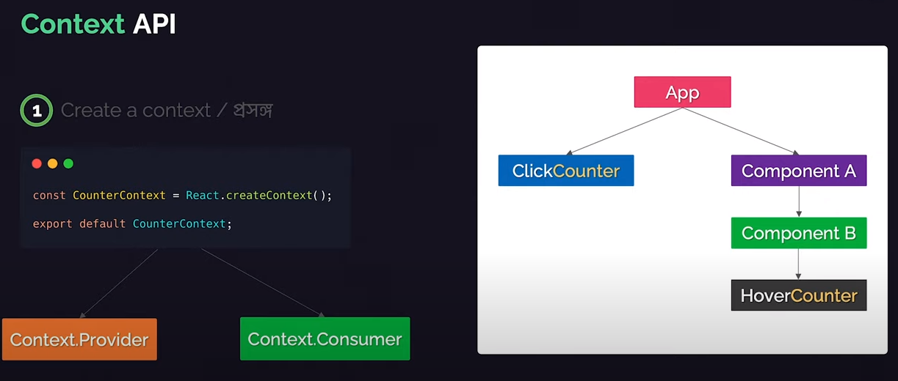
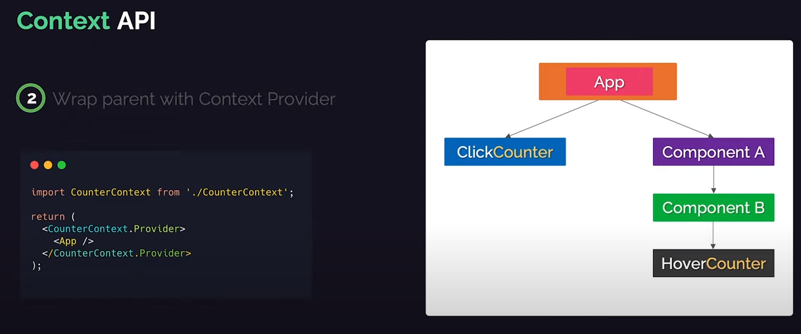
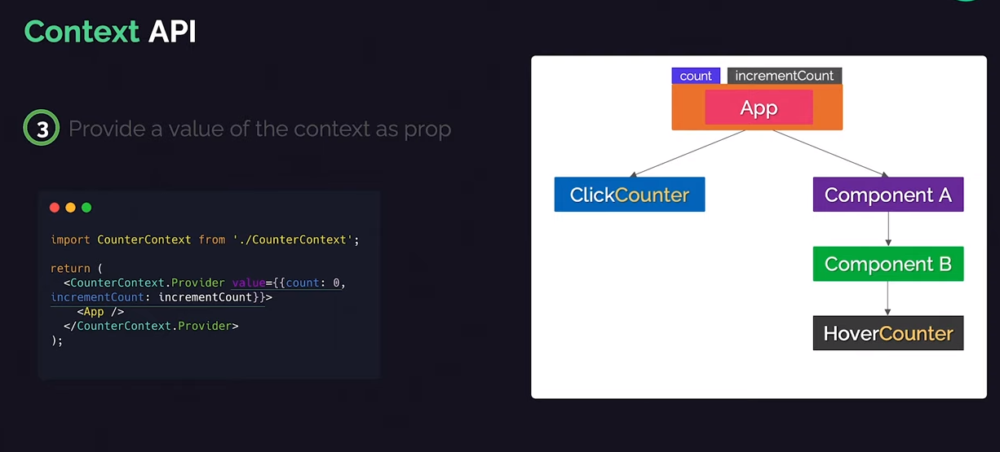
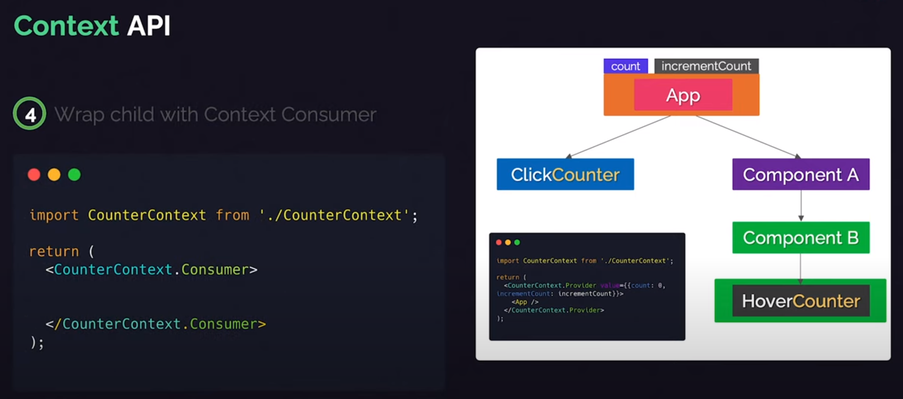
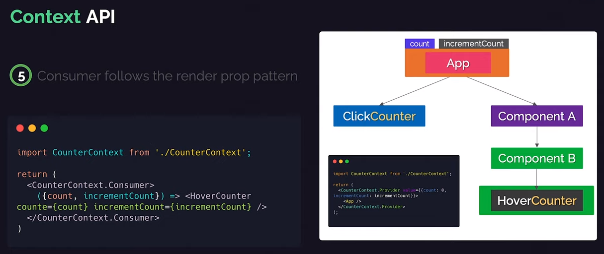
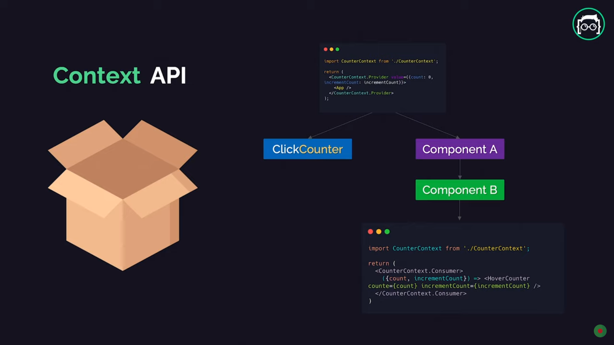
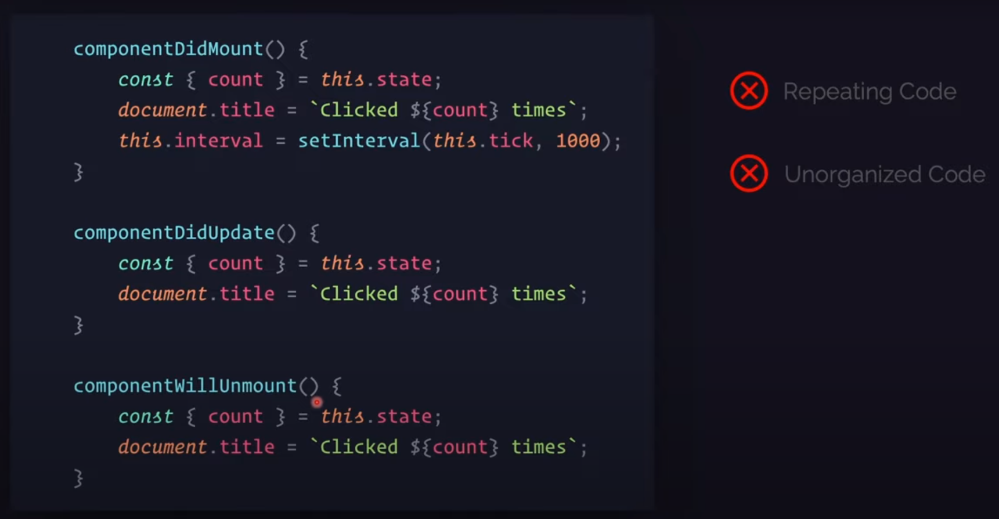
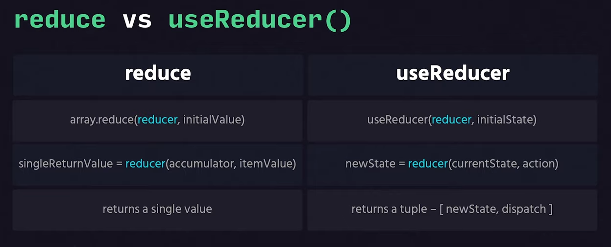
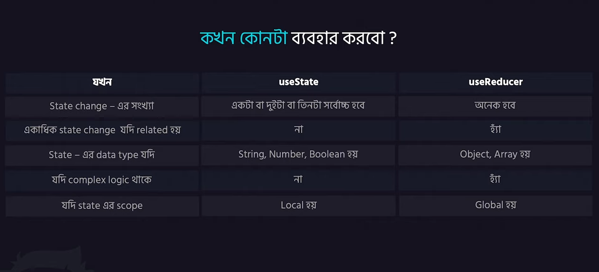

## Project

- First, check is there already any react app: create-react-app
- If it has, then remove it: yarn global remove create-react-app

- Create a react project with latest version: npx create-react-app myreact (directory)
  **Note**: This process has been discarded by react. So we have to follow another way to to start a react project.

- We are using Vite as a tool to start a react project.
- Install Vite: npm create vite@latest
- Follow the procedures

### Element:

- The structure of an element:

  ```js
  const element = (
    <h1 className="heading" tableIndex={index}>
      <span className="text">Hello {new Date().toLocaleDateStrin()}</span>
      
      <p id="name">Jamil</p>
    </h1>
  );

  /*
  element = {
      type: 'h1',
      props: {
          classname: 'heading',
          tableIndex: 0,
          children: [
              {
                  type: 'span',
                  props: {
                      className: 'text'
                  }
              },
              {
                  type: 'img',
                  props: {
                      src: ''
                  }
              },
              {
                  type: 'p',
                  props: {
                      id: 'name',
                      children: Jamil
                  }
              }
          ]
      }
  }
  */
  ```

- We can not change react element

### Component:

- Component basically returns a react element
- We can reuse a component multiple times
- We can pass attribute to component
- We should not change the values of props inside the Component

## State:

- State of a component is the data of the component which is chnaged.
- React reacts two time.
  - When the props has changed
  - When the state has changed
- **super()**: it calls the base class constructor
- **componentDidMount()**: it runs after component has been rendered to the DOM
- if we need state or props object value inside setState, then we should not call this.state, we should pass state and props inside a function. Then we can use the values. In this way we will get the correct value of state and props.

```js
// Wrong
this.setState({
  counter: this.state.counter + this.props.increment,
});

// Correct
this.setState((state, props) => ({
  counter: state.counter + props.increment,
}));

// Correct
this.setState(function (state, props) {
  return {
    counter: state.counter + props.increment,
  };
});
```

- React works like a “top-down” or “unidirectional” data flow.

## Event Handling:

- If we write a function like this- function(), it will call when the program load
- If we write a function like this- function, it will call when we hit the function
- We can prevent default operation in any event using preventDefault() function like this:

```js
function handleSubmit(e) {
  e.preventDefault();
  console.log("You clicked submit.");
}
```

## Forms:

- In react, we can controll the default DOM by ReactDOM
- If we pass value in react way, then we will allow react to handle it
- In we pass the value but not control it by the onChange method. then it will be read-only
- But if we pass the value={null}, then it won't be read-only. It will be changable.

## Lifting State Up:

- The structure tree of the coding approach:

```
                        Calculator(temp)
                            .
                          .   .
                        .       .
                      .            .
            TemperatureInput       BoilingVerdict
      (temp, scale, onTempChange)       (celcius)
```

- **Noted**:
  - There should be a single **source of truth** for any dtaa that changes in a React application
  - Rely on **Top-Down Data FLow** instead of syncing the state between different components
  - Lifting state involves writing more **boilerplate** code but takes less work to find bugs
  - We can implement any custom logic to **reject or transform user input**
  - If something can be **derived** from either props or state, it probably shouldn't be the state
  - Trace the bugs to their source easily by just moving to the top

## Composition vs Inheritance:

- Problems in Inheritance:

  - components are tightly coupled
  - from child, it's not clear what parents does
  - not clear about the parent child relation
  - future components will be tightly coupled which are extends parent class
  - nested extend - child that already extend other parent

- Composotion:
  - We use function rather than Class
  - We use props in lieu of extending a class
  - In here each fature component extends React.Component, but the binding component (like Text) will be a function

## Higher Order Components:

- A higher-order component is a function that takes a component as parameter and returns a new component.

```js
const NewComponent = higherOrderComponent(OriginalComponent);

// as like
const SpiderMan = withCostume(PeterParker);

// in code
const CountClickButton = withCounter(ClickCounter);
```

- As per HOC's naming convention, function name starts with **with**
- In HOC way, if we need to track any input filed hover count. Then we just create a component using withCounter.
- We do not repeat the count functionality

## Render prop:

- It is a prop that defines render logic
- It occurs from the App class
- In project code, ClickCounter and HoverCounter works as a presentation component and as a function. Counter class component manages the operation.
- We can use render prop in two ways.

  - First way:

    ```js
    // at App.jsx
    <Counter
        render={(count, incrementCount) => (
        <ClickCounter count={count} incrementCount={incrementCount} />
        )}
    />

    // at Counter.jsx
     render() {
        const {render} = this.props;
        const {count} = this.state;

        return render(count, this.incrementCount);
    }
    ```

  - Second way:

    ```js
    // at App.jsx
    <Counter>
        {(count, incrementCount) => (
            <ClickCounter count={count} incrementCount={incrementCount} />
        )}
    </Counter>

    // at Counter.jsx
    render() {
        const {children} = this.props;
        const {count} = this.state;

        return children(count, this.incrementCount);
    }
    ```

## Context API:

- Context provides a way to pass data through the component tree without having to pass props down manually at every level.
- Context is primarily used when some data needs to be accessible by many components at different nesting levels. Apply it sparingly because it makes component reuse more difficult.

  ```js
  const MyContext = React.createContext(defaultValue);

  export default MyContext;

                          MyContext
                              .
                          .       .
                      .               .
          MyContext.Provider      MyContext.Consumer
  ```

- The procedure of context API:
  
  
  
  
  

- Summery of Context API:
  

- We have created a custom Context class in our project's lib/ directory.
- ContextWithClass file has the Content component using Class
- We use a hook **useContext** in functional component

## Responsibilities of React:

- Render or re-render UI
- React to user input/actions

  - Render JSX Code
  - Manage state & props
  - React Events/Inputs
  - Evaluating State/Props Change

- **Side-effects**:
  - Anything other than React's responsibilities
  - Exm:
    - Fetching data from any API
    - Updating DOM
    - Setting any subscription
    - Set timer

## Hooks:

- Hooks can not be used inside Class Component. It can only be used in Functional Component
- We should have to use hooks only top level component.
- We can not use it on:
  - if condition
  - custom function etc

**useState**:

- We use this hook in lieu of state declaration and it's operation management
- Format of useState hook:

```js
const [count, setCount] = useState(0);

setCount((prevCount) => prevCount + 1);
```

**useEffect**:

- Reasons of using useEffect Hook:
  

  - Help us to perform side effects in functional components
  - Solves all the problems of lifecycle methods in class componets
  - We do not need to use React life cycle methods

- Format of useEffect() hook:

```js
// the second part is a condioning array
// where we put the value for which changes the hook will trigger
// the array is a dependency array
// we can only put outside values into the dependency array
useEffect(() => {
  document.title = `Clicked ${count} times`;
}, [count]);

// empty array means it will run for once
// return inside useEffect() means it will work as unmount
useEffect(() => {
  const interval = setInterval(tick, 1000);

  // do the cleanup - stop the timer
  return () => {
    console.log("component unmounted");
    clearInterval(interval);
  };
}, []);
```

**useCallBack**

- In JavaScript, a function means an object and it has a reference value
- So when parent component renders, eact of its child functions reference is updated. So the functions re-rendered
- This memorise a function when it rendered first time
- So the function will not rendered again when some actions occurs the same page
- Format of useCallback hook:

```js
// first param of this hook is a function which he stores
// second param is an array where we put the value for which changes the hook will trigger and restore the function
// empty array means it will run for once
const incrementByOne = useCallback(() => {
  setCount1((prevCount) => prevCount + 1);
}, []);
```

**useMemo**

- When we have a fucntion which will render after clicking a button and the function operation is costly.
- If any actions occured on the parent component, the costly functions called. So the loading time affects in each actions.
- So we use this hook. It stores the calue of the function in memory and only render when the given values has been changed.
- It looks similar like useCallback hook.
- Format of useCallback hook:

```js
// first param of this hook is a function whose retun value it stores
// second param is an array where we put the value for which changes the hook will trigger and restore the function's return value
const isEvenOrOdd = useMemo(() => {
  let i = 0;
  while (i < 1000000000) i += 1; // costly operation
  return count1 % 2 === 0;
}, [count1]);
```

**useRef**:

- If we want use the refernce in Reat way, then we have to use this hook
- Format of useCallback() hook:

```js
const inputRef = useRef(null);

useEffect(() => {
  inputRef.current.focus();
}, []);

return (
  <div>
    <p>
      <Input ref={inputRef} type="text" placeholder="Type something" />
    </p>
  </div>
);
```
- We have to use **React.forwardRef()** if we want to send the ref value from parent class to child class.

- **As a storage:**
  - We can use this hook as a storage
  - It will be similar like state but the component will not re-render even if the reference has been changed
  - Even if the component re-render, the previous reference will be stored


  **useReducer**:
  - This hook uses for state management
  - This is an alternative of useState() hook
  - Basically useState() hook created based on useReducer() hook
  - JS reduce() method vs useReducer() hook:
  
  - Counter.jsx file for creating a counter with this hook
  - How action works: example.html
  - CounterComplex.jsx file for creating multiple counter with one useReucer() hook
  - we can use this hook with context API
  - using useState -> GetPost, using useReducer -> GetPost2
  - In useReducer() hook, we can manage the logic in a central place
  - When we use useState or useReducer:
  